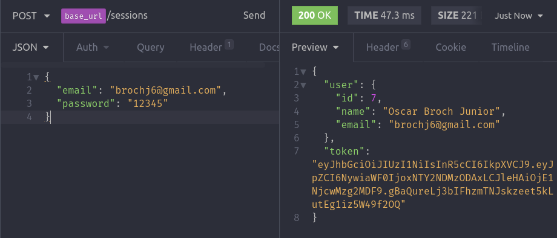
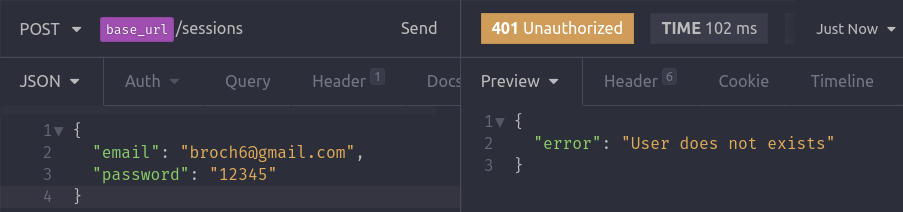
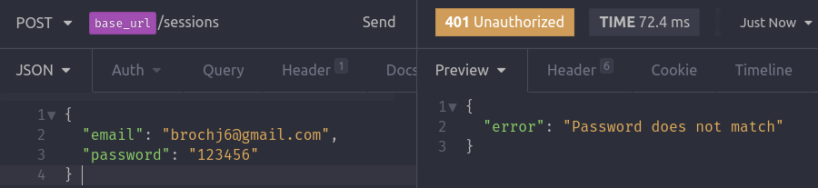

# Autenticação JWT

## Criação do Session Controller

- Instalar o jsonwebtoken

```bash
yarn add jsonwebtoken
```

- Criar um `SessionController.js` com o conteúdo.

```js
import jwt from "jsonwebtoken";
import * as Yup from "yup";
import authConfig from "../../config/auth";
import User from "../models/User";

class SessionController {
  async store(req, res) {
    // validacoes
    const schema = Yup.object().shape({
      name: Yup.string().required(),
      email: Yup.string().email().required(),
      password: Yup.string().required(),
    });

    if (!(await schema.isValid(req.body))) {
      return res.status(400).json({ error: "Validations fails" });
    }

    const { email, password } = req.body;

    // Verificando se existe o email no banco de dados
    const user = await User.findOne({ where: { email } });
    if (!user) {
      return res.status(401).json({ error: "User does not exists" });
    }

    // Verificando se a senha informada bate com a salva no DB
    // O decrypt da senha é feito no Model pelo método checkPassword(password))
    if (!(await user.checkPassword(password))) {
      return res.status(401).json({ error: "Password does not match" });
    }

    // Se passou pelas validações acima, pode-se gerar uma sessão pro usuário
    const { id, name } = user;
    return res.json({
      user: {
        id,
        name,
        email,
      },
      // Gerar token
      token: jwt.sign({ id }, authConfig.secret, {
        expiresIn: authConfig.expiresIn,
      }),
    });
  }
}
export default new SessionController();
```

### Gerando o token jwt

- Criar um arquivo `config/auth.js` e nele adicionar as variáveis.

```js
export default {
  secret: "022e48bba4be9ef278918a86f2a5fa4e",
  expiresIn: "7d", // 7 days
};
```

- `secret` deve ser uma chave única no planeta, para gerar, ir no site [md5 online](https://www.md5online.org/) e gerar um hash passando uma palavra. Pode ser qualquer coisa, mas geralmente utiliza-se algo do tipo `meuprojetonodejsjavascript35`

- Para gerar o token utiliza-se a lib jsonwebtoken, o primeiro parâmetro de sign() é o `payload`

```js
jwt.sign({ id }, authConfig.secret, {
  expiresIn: authConfig.expiresIn,
});
```

- Definir uma rota em `routes.js` que irá acessar esse SessionController

```js
...
import SessionController from './app/controllers/SessionController';
...
...
routes.post('/sessions', SessionController.store);
```

### Verificando se está funcionando

- Fazer uma request no Insomnia passando um email e password de um usuário que já está no banco de dados e teve a senha salva no DB através de geração de hash.



- Passando um email que não existe no banco de dados



- Passando uma senha errada


