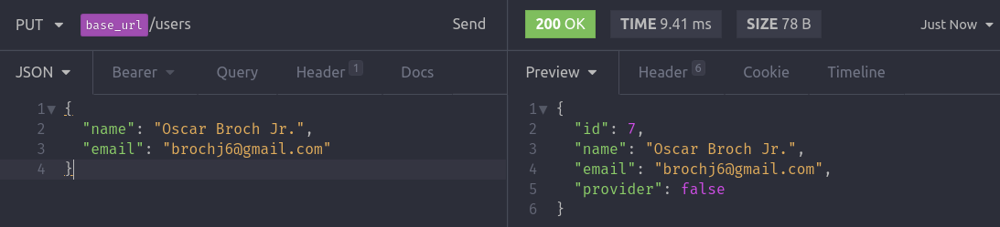
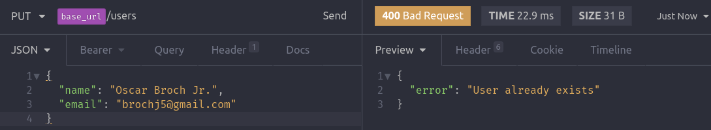
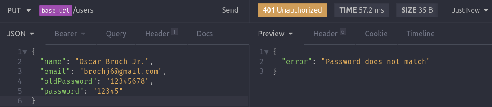

# Middleware de autenticação

## Update de usuário

É interessante bloquear o acesso de uma rota de update de usuário caso não exista uma sessão. Então para isso criaremos um middleware, que basicamente fará essa verificação.

Simplificando, a rota update só será acessível se na request for passado um Header com o JWT (válido) da sessão.

## Criando o middleware

Esse middleware tem como objetivo verificar se o usuário está logado.

> IMPORTANTE! O Token JWT gerado no momento do Login(autenticação) deverá ser passado em todos os **Headers** das requests (rotas) internas da aplicação. 
> 
> O Token será passado utilizando o **Bearer Token**

- Criar um arquivo na pasta `app/middlewares/auth.js` e adicionar

```js
import jwt from 'jsonwebtoken';
import { promisify } from 'util';

import authConfig from '../../config/auth';

export default async (req, res, next) => {
  const authHeader = req.headers.authorization;

  // Verifica se foi passado um Token no header
  if (!authHeader) {
    return res.status(401).json({ error: 'Token not provided' });
  }

  // authHeader = 'Bearer xcYaE7f2TCPs8ufAv7C_PG...'
  // Retiro a palavra Bearer e descarto, ficando somente com o token
  const [, token] = authHeader.split(' ');

  try {
    // decodificando para pegar o id que esta dentro do token jwt
    const decoded = await promisify(jwt.verify)(token, authConfig.secret);
    // Se jwt.verify der errado, cai pro catch.
    

    // Passa o id do usuario para dentro do req, 
    req.userId = decoded.id;
    // logo em UserController.update terá disponível esse id do usuário em req.userId

    return next();

  } catch (err) {
    return res.status(401).json({ error: 'Token invalid' });
  }
};

```

- `promisify` pega uma função que utiliza *callback* e transforma ela em uma função de **async/await**.
- `promisify` retorna uma função, por isso essa sintaxe ` await promisify(jwt.verify)()`. No segundo parentese indica que já estou executando a função que `promisify` retorna.
- `decoded` guarda payload do JWT, que no caso possui o { id }. Isso foi definido em `SessionController.js`


- No arquivo `routes.js` criar a rota de update.
```js
routes.put('/users', UserController.update);
```
- Adicionar o middleware `middlewares/auth.js` em `routes.js`

```js
import { Router } from 'express';

import UserController from './app/controllers/UserController';
import SessionController from './app/controllers/SessionController';
// importanto o middleware de autenticacao
import authMiddleware from './app/middlewares/auth';

const routes = new Router();

routes.post('/users', UserController.store);
routes.post('/sessions', SessionController.store);

routes.use(authMiddleware);
// OBS: Todas as rotas abaixo serão verificadas pelo authMiddleware
routes.put('/users', UserController.update);

export default routes;


```
## Criando o update()

- Criar o método `update()` no `UserController.js`

```js
async update(req, res) {
   
    const { email, oldPassword } = req.body;

    const user = await User.findByPk(req.userId); // user contem os dados do DB

    // Verificando se o usario quis trocar de email.
    if (email !== user.email) {
      // Verificando se ja existe algum outro usuário 
      // com email passado pelo usuário logado
      const userExists = await User.findOne({ where: { email } });

      if (userExists) {
        return res.status(400).json({ error: 'User already exists' });
      }
    }

    // Verificando se o usario quis trocar de senha.
    // Verificando se a senha "antiga" confere com a senha salva no DB
    if (oldPassword && !(await user.checkPassword(oldPassword))) {
      return res.status(401).json({ error: 'Password does not match' });
    }

    const { id, name, provider } = await user.update(req.body);

    return res.json({ id, name, email, provider });
  }
``` 
## Verificando se está funcionando
- Fazer uma request no Insomnia passando um email e password de um usuário que já está no banco de dados e teve a senha salva no DB através de geração de hash.

- Mudando nome



- Passando um email que já existe no banco de dados



- Passando uma senha errada

