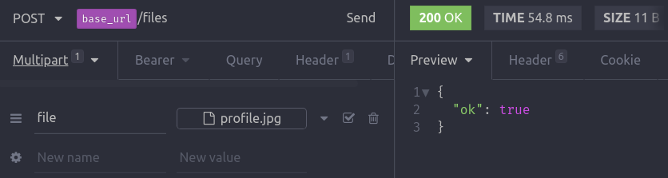
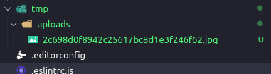
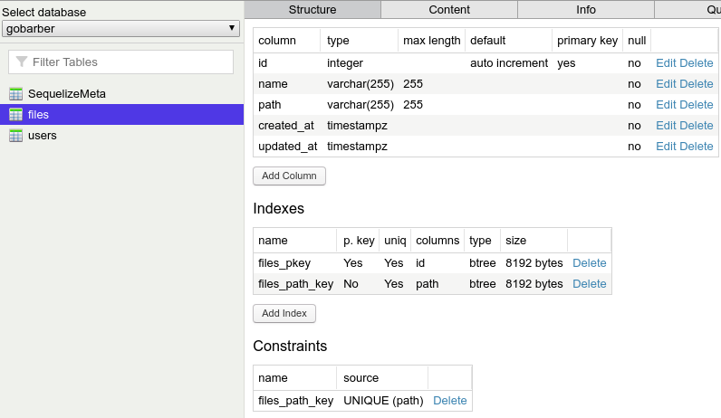
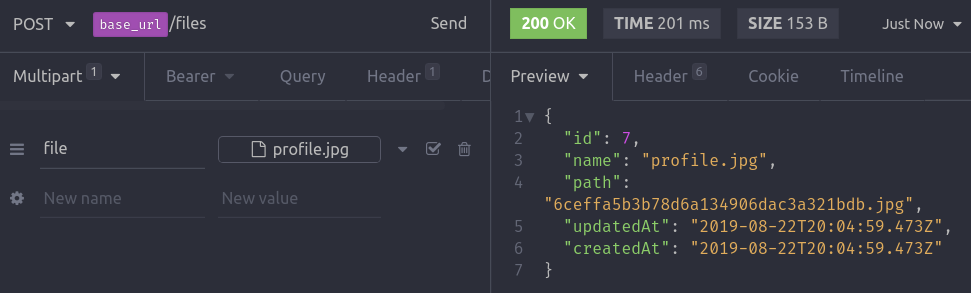
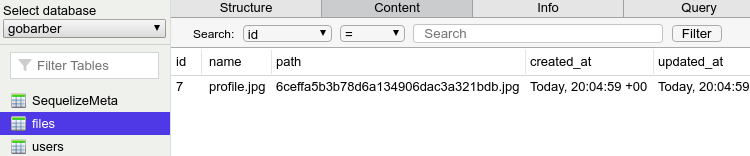

# Uploade de arquivos

## Fluxo de dados

- Tomando com exemplo um cadastro que tem um avatar.

1. O Usuário seleciona a foto;
2. É feita uma requisição e a foto é salva, pelo retorno da requisição vem o ID da foto salva no banco de dados;
3. Armazena-se esse ID da foto no front-end;
4. Quando o usuário termina de preencher seus dados como nome, email, etc. E envia os dados(segunda requisição), o Id da foto vai junto.
- Fazendo dessa maneira, conseguimos manter a utilização do JSON, já que não é possível passar arquivos por JSON.

- Outra maneira de fazer isso seria enviar tudo em uma requisição só. Mas não daria mais pra usar JSON.


## Configurando o multer

Para upload de arquivos, tem que usar a estrutura de multformpartdata

`yarn add multer`

- Criar pasta na raiz `/tmp/uploads`
- Dentro de `config` criar `multer.js`

```js
  // Toda config de upload de arquivos
  import multer from 'multer';
  import crypto from 'crypto'; // do node

  import { extname, resolve } from 'path';
  // extname , retira a extensao do arquivo

  export default {
    storage: multer.diskStorage({
      destination: resolve(__dirname, '..', '..', 'tmp', 'uploads'),
      filename: (req, file, callback) => {
        // req, tem aquele mesmo conteudo dos controllers
        // file - todos os dados do arquivo que o usuario fez upload
        // gerar nome unico
        crypto.randomBytes(16, (err, res) => {
          if (err) return callback(err);

          // passo o null, pq o primeiro parametro é pra qndo da erro
          return callback(null, res.toString('hex') + extname(file.originalname)); // transformo os 16 bytes em uma string hexadecimal
        });
      },
    }),
  };
```

- Para testar, ir em `routes.js`
- importar a lib `multer` e as config

```js
...
import multer from 'multer';
import multerConfig from './config/multer';

...

const routes = new Router();

const upload = multer(multerConfig);
..

routes.use(authMiddleware); // todas as rotas abaixo terao esse middleware

routes.put('/users', UserController.update);


routes.post('/files', upload.single('file'),(req, res) => {
  return res.json({ ok: true });
});

export default routes;

``` 

- `single()` - um arquivo unico na requisicao, 
- `file` - nome do campo que vai ser enviado na requisicão.

## Verificando

-  No insomnia configurar um Request do tipo POST, e em vez de escolher o JSON, escolher o `Multipart Form` (Não esquecer de passar um token de autiticação, já que upload só será possível dentro da aplicação nesse caso.)

- No insomnia



- Depois da request, o arquivo deve ter salvo na pasta `tmp/uploads` com o nome aleatorio que foi gerado no arquivo de config do multer.



# Salvando no banco de dados

## FileController

-  Criar um novo controller responsável pelo arquivos.

```js
class FileController {
  async store(req, res) {
    return res.json({ ok: true });
  }
}

export default new FileController();

```

- Criar arquivo de tabela de no banco de dados

```bash
yarn sequelize migration:create --name=create-files
```

- no arquivo gerado, copiar o conteuúdo da migration anterior e colar na nova e trocar o nome da tabela de `users` pra `files`. Deve ficar assim:

```js
module.exports = {
  up: (queryInterface, Sequelize) => {
    // up : 'e chamado ando a migrations eh executa
    return queryInterface.createTable('files', {
      id: {
        type: Sequelize.INTEGER,
        allowNull: false,
        autoIncrement: true,
        primaryKey: true,
      },
      name: {
        type: Sequelize.STRING,
        allowNull: false,
      },
      path: {
        type: Sequelize.STRING,
        allowNull: false,
        unique: true,
      },
      created_at: {
        type: Sequelize.DATE,
        allowNull: false,
      },
      updated_at: {
        type: Sequelize.DATE,
        allowNull: false,
      },
    });
  },

  down: queryInterface => {
    return queryInterface.dropTable('files');
  },
};

```
- Criar a tabela no banco de dados

```bash
yarn sequelize db:migrate
```
- Depois no Postbird deve aparecer a tabela.



- ## Model File
- Criar um model file, usar como base o Model User

```js
  import Sequelize, { Model } from 'sequelize';

  class File extends Model {
    static init(sequelize) {
      super.init(
        {
          name: Sequelize.STRING,
          path: Sequelize.STRING,
        },
        { sequelize }
      );

      return this;
    }
  }

  export default File;

```

- dentro do loader de model em `database/index.js` precisa importar esse Model File
- E colocar dentro do array  `const models = [User, File];`

- A partir desse momento é possivel fazer o import do Model File dentro do `FileController`.

```js
  import File from '../models/File';

  class FileController {
    async store(req, res) {
      // originalName - Nome do arquivo que estava na maq do usuario
      // filename - nome gerado aleatorio gerado pelo config/multer
      const { originalname: name, filename: path } = req.file; // o multer que add esse file no req.

      const file = await File.create({
        name,
        path,
      });

      return res.json(file);
    }
  }

  export default new FileController();
```

- No insomnia



- Depois da request, o arquivo deve ter salvo na pasta `tmp/uploads` com o nome aleatorio e também salvo os dados no Database.



## Gerar relacao entre as tabelas

-  Criar um novo campo na tabela de usuários, para isso tem que criar uma nova migration
```bash
yarn sequelize migration:create --name=add-avatar-field-to-users
```

- No arquivo da migration

```js
  module.exports = {
    up: (queryInterface, Sequelize) => {
      return queryInterface.addColumn(
        'users', // qual tabela
        'avatar_id', // qual nome da coluna
        {
          type: Sequelize.INTEGER,
          // Resumindo, todo avatar_id, tmbm vai ser um id contido na tabela files
          references: { model: 'files', key: 'id' }, // foreign key
          // Se o avatar_id (table users) for alterado, repassa a alteracao em id (table files)
          onUpdate: 'CASCADE',
          // Se o avatar_id (table users) for deletado, seta null no id (table files)
          onDelete: 'SET NULL',
          allowNull: true,
        }
      );
    },

    down: queryInterface => {
      return queryInterface.removeColumn('users', 'avatar_id');
    },
  };
```

- Adiciona a coluna no banco de dados

```bash
yarn sequelize db:migrate
```

- Fazer a request no Insomnia e ver a colunada adicionada no Postbird.

