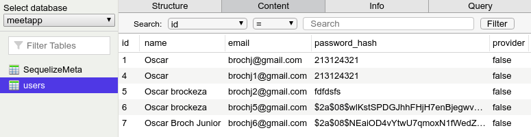

# Gerar Hash

## Gerando hash de senha

Nessa seção mostra como gerar um hash de uma senha. Esse hash é que será salvo no banco de dados, e não a senha do usuário.

-  Instalar o `bcryptjs`

```bash
yarn add bcryptjs
```

- No Model `User.js` importar o bcryptjs e fazer as alterações.

```js
import Sequelize, { Model } from 'sequelize';
import bcrypt from 'bcryptjs';

class User extends Model {
  static init(sequelize) {
    super.init(
      {
        // OBS: esses campos abaixo NÃO precisam ser um reflexo dos
        // campos que estão na base de dados
        name: Sequelize.STRING,
        email: Sequelize.STRING,
        password: Sequelize.VIRTUAL,
        // esse campo VIRTUAL nunca vai existir no DB, somente no lado do código
        password_hash: Sequelize.STRING,
        provider: Sequelize.BOOLEAN,
      },
      { sequelize }
    );

    this.addHook('beforeSave', async user => {
      if (user.password) {
        user.password_hash = await bcrypt.hash(user.password, 8);
      }
    });

    return this; // retorna o Model que foi inicializado aqui dentro.
  }
}

export default User;
```

### O que é Hooks?

Hooks são uma funcionalidade do Sequelize. São trechos de código que são executados de forma automática, baseado em ações que acontecem no Model onde estão inseridos.

- Exemplo:
  - Quando utiliza-se o Hook `'beforeSave '` antes de qualquer usuário ser salvo/alterado no banco de dados, o trecho de código que dentro desse hook (segundo parâmetro) será executado de forma automática.

```js
  this.addHook('beforeSave', async user => {
    // trecho de código à ser executado antes de salvar no DB
  });
```

  - Nesse caso `beforeSave`, caso eu coloque um `user.name = 'Oscar'` dentro do Hook, eu vou **sobrescrever** o name que o usuário enviou pela requisição, sendo assim todos os usuários que forem criados vão ficar com o `name = 'Oscar'`. 
  - Ou seja, nesse trecho pode-se manipular a informação do usuário antes de salvá-la no banco de dados.

### Fluxo dos dados
1. O usuário faz a requisição passando os seguintes dados: 

```json
{
	"name": "Oscar Broch",
	"email": "brochj@gmail.com",
	"password": "12345"
}
```
2. Com o `password` podemos gerar o hash com o bcrypt e passar/sobscrever esse hash para `password_hash`. 

```js
  if (user.password) {
    user.password_hash = await bcrypt.hash(user.password, 8);
  }
```

> Como `password` foi definido como VIRTUAL, ele não é necessário para fazer a gravação no banco de dados efetivamente.

### Testando geração hash
- Para verificar se está funcionando, na request do tipo POST no Insomnia, alterar no body `"password_hash"` para `"password"`.

```json
{
	"name": "Oscar Broch Junior",
	"email": "brochjg@gmail.com",
	"password": "12345"
}
```

-  `http://localhost:3333/users` e a resposta deve ser como abaixo. 
```json
{
  "id": 5,
  "name": "Oscar Broch Junior",
  "email": "brochj6@gmail.com",
  "provider": false
}
```

- Porém no Postbird nesse usuário deve aparecer apenas o `password_hash` dentro do banco de dados :

