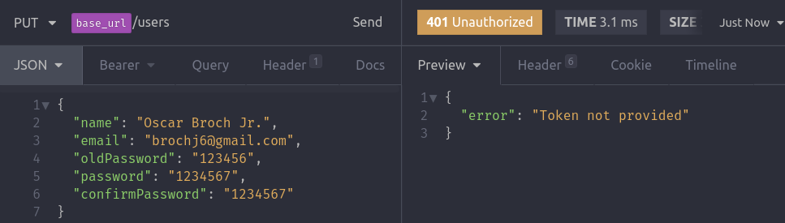
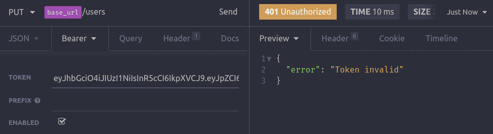
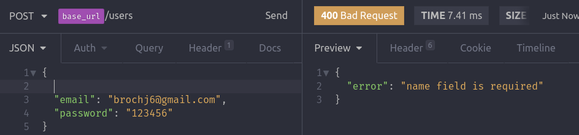
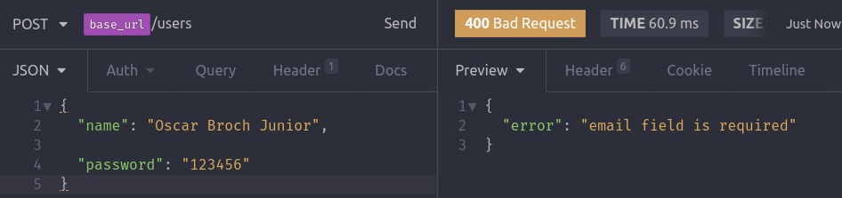
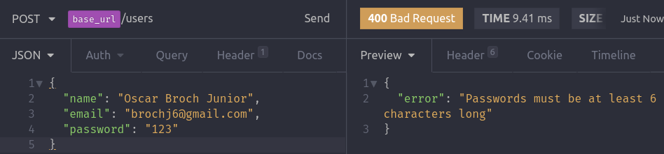

# Validando dados de entrada

Esse tipo de validação é insteressante estar no frontend e também no backend.

```bash
yarn add yup
```

- O Yup é uma lib de schema validation. É uma forma mais fácil de definir os campos que estão presentes, quais serão obrigatórios, quantidade minima de caracteres, etc.

- No arquivo `UserController.js` dentro do método `store()`.

```js
  // Fas o import dessa maneira pois 'yup' não tem
  // nenhum export default
  import * as Yup from 'yup';

  async store(req, res) {

  // validacão de criação de usuário
    const schema = Yup.object().shape({
      name: Yup.string().required('name field is required'),
      email: Yup.string()
        .email('invalid email')
        .required('name field is required'),
      password: Yup.string()
        .min(6, 'Passwords must be at least 6 characters long')
        .required(),
    });

    schema
      .validate(req.body)
      .catch(e => res.status(400).json({ error: e.errors }));
    // outra forma de validar - Porem não tem acesso as msgs de erros criadas
    // if (!(await schema.isValid(req.body))) {
    //   return res.status(400).json({ error: 'Validations fails' });
    // }

  ...
  }

```

- No arquivo `UserController.js` dentro do método `update()`.

```js
  async update(req, res) {

   // validacão de update de usuário
    const schema = Yup.object().shape({
      name: Yup.string(),
      email: Yup.string().email('invalid email'),
      oldPassword: Yup.string().min(
        6,
        'Passwords must be at least 6 characters long'
      ),
      password: Yup.string()
        .min(6, 'Passwords must be at least 6 characters long')
        .when('oldPassword', (oldPassword, field) =>
          oldPassword ? field.required() : field
        ),
      confirmPassword: Yup.string().when('password', (password, field) =>
        password ? field.required().oneOf([Yup.ref('password')]) : field
      ),
    });

    schema
      .validate(req.body)
      .catch(e => res.status(400).json({ error: e.errors }));

  ...
  }

```

- `oneOf([Yup.ref('password')])` verifica se o campo `password` é igual ao campo `oldPassword`.
- `oneOf([ ])` dentro desse array eu poderia passar outros valores. Mas como nesse caso é uma confirmação de senha, tem que ter apenas um.

## When() do Yup

- O método `when()` serve para fazer uma validação condicional dentro do próprio objeto Yup criado.
- O a funcao do segundo parâmetro só é executada se o campo do primeiro parâmetro foi preenchido.
- `.when()` tem acesso à todos os outros campos do objeto Yup, no caso `name`,`email` e `oldPassword`
- o `field` dentro do segundo parâmetro, é o próprio campo que está sendo verificado. No exemplo abaixo:

```js
password: Yup.string().min(6)
        .when('oldPassword', (oldPassword, field) =>
          oldPassword ? field.required() : field
        ),
```

- `field` se refere ao `password`. Pode-se ler da seguinte maneira. Se `oldPassword` existe, então `password` is required.
- Na prática é algo assim que acontece:

```js
oldPassword ? password.required() : password;
```

## Verificando se está funcionando

- Fazer uma request no Insomnia.

- Tentando acessar rotas internas sem o token



- Tentando acessar rotas internas com token inválido



- Tentando criar conta sem nome



- Tentando criar conta/logar sem email



- Tentando criar conta/logar com senha fraca


