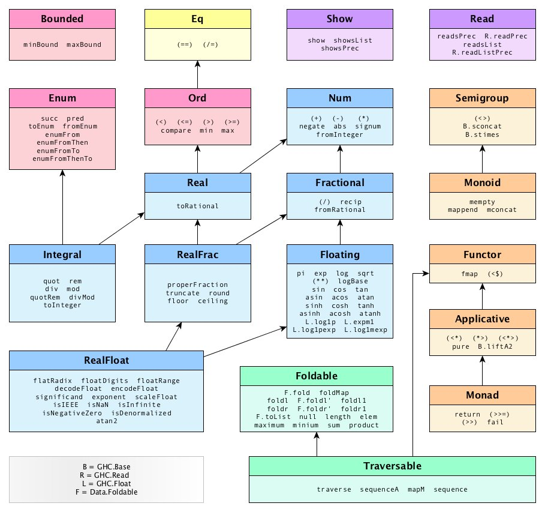

# Types and Typeclasses

Now we'll use GHCI to examine the types of some expressions. We'll do that by using the :t command which, followed by any valid expression, tells us its type.

```sh
ghci> :t 'a'
'a' :: Char

ghci> :t True
True :: Bool

ghci> :t "HELLO!"
"HELLO!" :: [Char]

ghci> :t (True, 'a')
(True, 'a') :: (Bool, Char)

ghci> :t 4 == 5
4 == 5 :: Bool
```

Here we see that doing `:t` on an expression prints out the expression followed by `::` and its type.

- **`::` is read as "has type of".**

Functions also have types.

When writing our own functions, we can choose to give them an explicit type declaration. This is generally considered to be good practice except when writing very short functions. From here on, we'll give all the functions that we make type declarations

```sh
removeNonUppercase :: [Char] -> [Char]
removeNonUppercase st = [ c | c <- st, c `elem` ['A'..'Z']]
```

`removeNonUppercase` has a type of `[Char] -> [Char]`, meaning that it maps from a string to a string. That's because it takes one string as a parameter and returns another as a result. The `[Char]` type is synonymous with `String` so it's clearer if we write `removeNonUppercase :: String -> String`.

```sh
addThree :: Int -> Int -> Int -> Int
addThree x y z = x + y + z
```

The parameters are separated with `->` and there's no special distinction between the parameters and the return type. The return type is the last item in the declaration and the parameters are the first three. Later on we'll see why they're all just separated with -> instead of having some more explicit distinction between the return types and the parameters like `Int, Int, Int -> Int` or something.

If you want to give your function a type declaration but are unsure as to what it should be, you can always just write the function without it and then check it with `:t`. Functions are expressions too, so `:t` works on them without a problem.

## Types

### `Int`

`Int` is bounded, which means that it has a minimum and a maximum value. Usually on 32-bit machines the maximum possible `Int` is `2147483647` and the minimum is `-2147483648`.

### `Integer`

The main difference is that it's not bounded so it can be used to represent really really big numbers.

### `Float` is a real floating point with single precision.

```haskell
circumference :: Float -> Float
circumference r = 2 * pi * r
```

```sh
ghci> circumference 4.0
25.132742
```

### `Double` is a real floating point with double the precision!

```haskell
circumference' :: Double -> Double
circumference' r = 2 * pi * r
```

```sh
ghci> circumference' 4.0
25.132741228718345
```

### `Bool`

### `Char`

## Typeclasses

A typeclass is a **sort of interface** that defines some behavior. If a type is a part of a typeclass, that means that it supports and implements the behavior the typeclass describes. A lot of people coming from OOP get confused by typeclasses because they think they are like classes in object oriented languages. Well, **they're not**. You can think of them kind of as Java interfaces, only better.

What's the type signature of the `==` function?

```sh
ghci> :t (==)
(==) :: (Eq a) => a -> a -> Bool
```

Interesting. We see a new thing here, the `=>` symbol. Everything before the `=>` symbol is called a **class constraint**.

We can read the previous type declaration like this:

> the equality function takes any two values that are of the same type and returns a Bool. The type of those two values must be a member of the `Eq` class (this was the class constraint)

The `Eq` typeclass provides an interface for testing for equality. Any type where it makes sense to test for equality between two values of that type should be a member of the `Eq` class.

All standard Haskell types except for IO (the type for dealing with input and output) and functions are a part of the `Eq` typeclass.

The `elem` function has a type of `(Eq a) => a -> [a] -> Bool` **because it uses `==` over a list to check whether some value we're looking for is in it**.

### `Eq`

`Eq` is used for types that support equality testing.

The functions its members implement are `==` and `/=`. So if there's an `Eq` class constraint for a type variable in a function, it uses `==` or `/=` somewhere inside its definition. All the types we mentioned previously except for functions are part of `Eq`, so they can be tested for equality.

```sh
ghci> 5 == 5
True

ghci> 5 /= 5
False

ghci> 'a' == 'a'
True

ghci> "Ho Ho" == "Ho Ho"
True

ghci> 3.432 == 3.432
True
```

### `Ord`

`Ord` is for types that have an ordering.

```sh
ghci> :t (>)
(>) :: (Ord a) => a -> a -> Bool

ghci> :t compare
compare :: Ord a => a -> a -> Ordering
```

All the types we covered so far except for functions are part of `Ord`. `Ord` covers all the standard comparing functions such as `>`, `<`, `>=` and `<=`.

The `compare` function takes two `Ord` members of the same type and returns an ordering.

`Ordering` is a type that can be `GT`, `LT` or `EQ`, meaning greater than, lesser than and equal, respectively.

To be a member of `Ord`, a type must first have membership in the prestigious and exclusive `Eq` club

```sh
ghci> "Abrakadabra" < "Zebra"
True

ghci> "Abrakadabra" `compare` "Zebra"
LT

ghci> 5 >= 2
True

ghci> 5 `compare` 3
GT
```

### `Show`

Members of `Show` can be presented as strings. All types covered so far except for functions are a part of `Show`. The most used function that deals with the `Show` typeclass is `show`. It takes a value whose type is a member of `Show` and presents it to us as a string.

```sh
ghci> show 3
"3"
ghci> show 5.334
"5.334"
ghci> show True
"True"
```

`Read` is sort of the opposite typeclass of Show. The `read` function takes a string and returns a type which is a member of `Read`.

```sh
ghci> read "True" || False
True
ghci> read "8.2" + 3.8
12.0
ghci> read "5" - 2
3
ghci> read "[1,2,3,4]" ++ [3]
[1,2,3,4,3]
```

So far so good. Again, all types covered so far are in this typeclass. But what happens if we try to do just `read "4"`?

```sh
ghci> :t read
read :: (Read a) => String -> a
```

```sh
ghci> read "5" :: Int
5
ghci> read "5" :: Float
5.0
ghci> (read "5" :: Float) * 4
20.0
ghci> read "[1,2,3,4]" :: [Int]
[1,2,3,4]
ghci> read "(3, 'a')" :: (Int, Char)
(3, 'a')
```

```haskell
Enum -> ((), Bool, Char, Ordering, Int, Integer, Float, Double)

Num -> (Int, Integer, Float, Double)

Integral -> (Int, Integer)

Floating -> (Float, Double)
```


