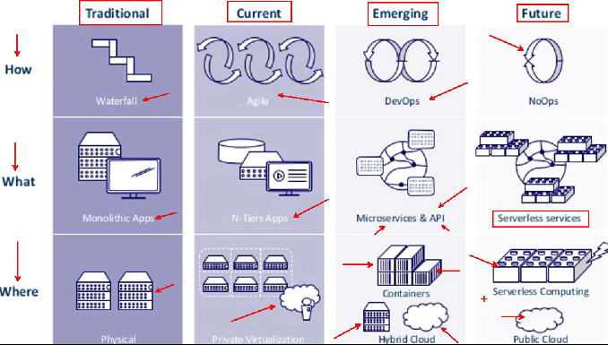

> “Arquitetura é a organização fundamental de um sistema incorporada em seus componentes, relacionamentos com o ambiente e os princípios que conduzem seu design e evolução.” [ISO/IEEE 42010-2011]

- Manual TOGAF Framework de arquitetura para grandes empresas, tem até certificação

